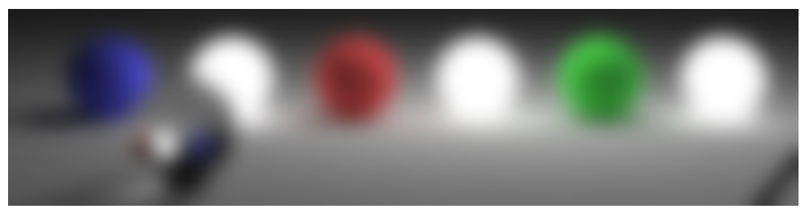

# fast_blur

## 概要

Ivan Kutskir氏の「高速ガウシアンブラー」でぼかしを掛けます。



参考：[https://blog.ivank.net/fastest-gaussian-blur.html](https://blog.ivank.net/fastest-gaussian-blur.html)

## コード

```js
function boxesForGauss(sigma, n)  // standard deviation, number of boxes
{
    var wIdeal = Math.sqrt((12*sigma*sigma/n)+1);  // Ideal averaging filter width
    var wl = Math.floor(wIdeal);  if(wl%2==0) wl--;
    var wu = wl+2;

    var mIdeal = (12*sigma*sigma - n*wl*wl - 4*n*wl - 3*n)/(-4*wl - 4);
    var m = Math.round(mIdeal);
    // var sigmaActual = Math.sqrt( (m*wl*wl + (n-m)*wu*wu - n)/12 );

    var sizes = [];  for(var i=0; i<n; i++) sizes.push(i<m?wl:wu);
    return sizes;
}
function gaussBlur_4 (scl, tcl, w, h, r) {
    var bxs = boxesForGauss(r, 3);
    boxBlur_4 (scl, tcl, w, h, (bxs[0]-1)/2);
    boxBlur_4 (tcl, scl, w, h, (bxs[1]-1)/2);
    boxBlur_4 (scl, tcl, w, h, (bxs[2]-1)/2);
}
function boxBlur_4 (scl, tcl, w, h, r) {
    for(var i=0; i<scl.length; i++) tcl[i] = scl[i];
    boxBlurH_4(tcl, scl, w, h, r);
    boxBlurT_4(scl, tcl, w, h, r);
}
function boxBlurH_4 (scl, tcl, w, h, r) {
    var iarr = 1 / (r+r+1);
    for(var i=0; i<h; i++) {
        var ti = i*w, li = ti, ri = ti+r;
        var fv = scl[ti], lv = scl[ti+w-1], val = (r+1)*fv;
        for(var j=0; j<r; j++) val += scl[ti+j];
        for(var j=0  ; j<=r ; j++) { val += scl[ri++] - fv       ;   tcl[ti++] = Math.round(val*iarr); }
        for(var j=r+1; j<w-r; j++) { val += scl[ri++] - scl[li++];   tcl[ti++] = Math.round(val*iarr); }
        for(var j=w-r; j<w  ; j++) { val += lv        - scl[li++];   tcl[ti++] = Math.round(val*iarr); }
    }
}
function boxBlurT_4 (scl, tcl, w, h, r) {
    var iarr = 1 / (r+r+1);
    for(var i=0; i<w; i++) {
        var ti = i, li = ti, ri = ti+r*w;
        var fv = scl[ti], lv = scl[ti+w*(h-1)], val = (r+1)*fv;
        for(var j=0; j<r; j++) val += scl[ti+j*w];
        for(var j=0  ; j<=r ; j++) { val += scl[ri] - fv     ;  tcl[ti] = Math.round(val*iarr);  ri+=w; ti+=w; }
        for(var j=r+1; j<h-r; j++) { val += scl[ri] - scl[li];  tcl[ti] = Math.round(val*iarr);  li+=w; ri+=w; ti+=w; }
        for(var j=h-r; j<h  ; j++) { val += lv      - scl[li];  tcl[ti] = Math.round(val*iarr);  li+=w; ti+=w; }
    }
}

/**
 * Ivan Kutskir氏の「高速ガウシアンブラー」を施す。
 * @param {CanvasRenderingContext2D} ctx - 描画先の 2D コンテキスト
 * @param {number} x - 描画領域の左上 x 座標
 * @param {number} y - 描画領域の左上 y 座標
 * @param {number} width - 描画領域の幅
 * @param {number} height - 描画領域の高さ
 * @param {CanvasRenderingContext2D} ctx2 - 元画像の 2D コンテキスト
 * @param {number} sx - 元画像の左上 x 座標
 * @param {number} sy - 元画像の左上 y 座標
 * @param {number} radius - ぼかしの半径（sigma）
 */
const fastBlur = (ctx, x, y, width, height, ctx2, sx, sy, radius) => {
    // 1. キャンバスから画像データを取得
    let imageData = ctx2.getImageData(sx, sy, width, height);
    let data = imageData.data; // [r, g, b, a, r, g, b, a, ...] という並び

    // 2. 各チャンネル（R, G, B）ごとに配列を作成
    let r_chan = new Uint8Array(width * height);
    let g_chan = new Uint8Array(width * height);
    let b_chan = new Uint8Array(width * height);
    let r_out = new Uint8Array(width * height);
    let g_out = new Uint8Array(width * height);
    let b_out = new Uint8Array(width * height);

    // 3. 元のデータを各チャンネルに分ける
    for (let i = 0; i < width * height; i++) {
        r_chan[i] = data[i * 4];
        g_chan[i] = data[i * 4 + 1];
        b_chan[i] = data[i * 4 + 2];
    }

    // 4. gaussBlur_4 を適用
    gaussBlur_4(r_chan, r_out, width, height, radius);
    gaussBlur_4(g_chan, g_out, width, height, radius);
    gaussBlur_4(b_chan, b_out, width, height, radius);

    // 5. 処理したデータを元の imageData に戻す
    for (let i = 0; i < width * height; i++) {
        data[i * 4]     = r_out[i];
        data[i * 4 + 1] = g_out[i];
        data[i * 4 + 2] = b_out[i];
        // alpha (data[i*4+3]) はそのまま
    }

    // 6. キャンバスに描画
    ctx.putImageData(imageData, x, y);
};

// 描画する関数
const render = () => {
    let width = canvas.width, height = canvas.height;
    ctx.clearRect(0, 0, width, height);

    if (img.complete) {
        ctx.drawImage(img, 0, 0);

        let time0 = (new Date()).getTime();

        fastBlur(ctx, 0, 0, width, height, ctx, 0, 0, 10);

        let time1 = (new Date()).getTime();
        time.innerText = `${time1 - time0} ms`;
    }
    
    if (anime) anime = window.requestAnimationFrame(render);
};

// アニメーションを開始する
anime = window.requestAnimationFrame(render);
```
